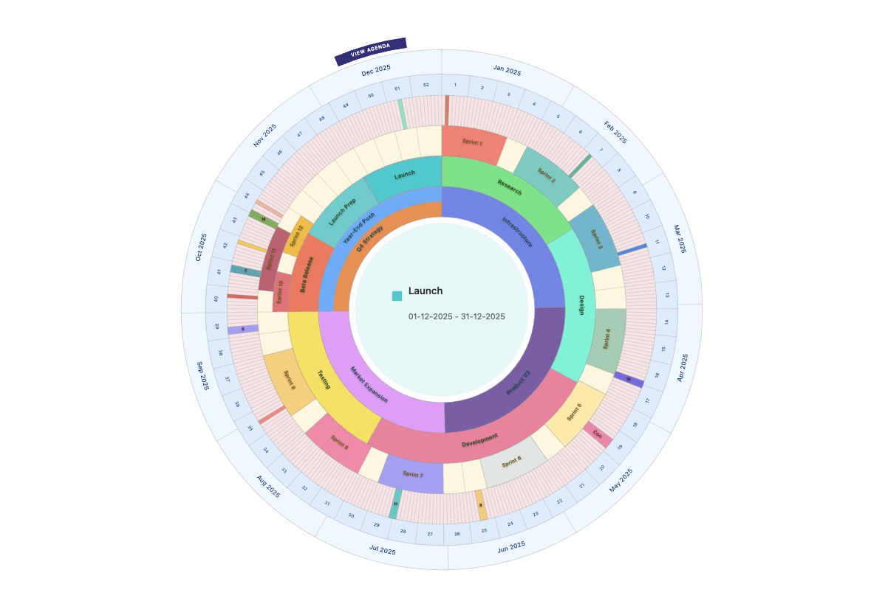

# Circalify



A flexible, zero-dependency JavaScript library for creating circular timeline visualizations.

Perfect for annual planning, project timelines, and cyclical data. Built with pure JavaScript and SVG.

📺 **[Live Demo](https://codepen.io/mahmoodseoud/pen/ByjJOVE)** | 📦 [npm](https://npmjs.com/package/circalify) | ⭐ [GitHub](https://github.com/MahmoodSeoud/circalify)

## Why Circular Timelines?

Circular layouts excel at showing:
- **Cyclical patterns** - Annual processes, seasonal data
- **Year-at-a-glance** - See the entire year in one view
- **Multiple layers** - Compare different event types side-by-side
- **Space efficiency** - Fit more information in less screen space

Traditional linear timelines are better for sequences and chronology. Circular timelines are better for cycles and patterns.

## Installation

```bash
npm install circalify
```

## Quick Start

### Minimal Example (3 lines)

```javascript
import CircularTimeline from 'circalify';

const timeline = new CircularTimeline('#timeline', {
    startYear: 2025,
    rings: [{ type: 'calendar' }]
});
```

### With Events

```javascript
import CircularTimeline from 'circalify';

const timeline = new CircularTimeline('#timeline', {
    startYear: 2025,
    rings: [
        { type: 'calendar' },
        { type: 'data', name: 'Events' }
    ]
});

timeline.setData([
    { label: 'Launch', startDate: '2025-03-15', endDate: '2025-03-15' }
], 'Events');
```

### Using CDN (No Build Step)

```html
<!DOCTYPE html>
<html>
<head>
    <style>
        #timeline { width: 100%; height: 600px; }
    </style>
</head>
<body>
    <div id="timeline"></div>

    <script type="module">
        import CircularTimeline from 'https://unpkg.com/circalify@latest/src/index.js';

        const timeline = new CircularTimeline('#timeline', {
            startYear: 2025,
            rings: [
                { type: 'calendar', calendarType: 'month-names' },
                { type: 'data', name: 'Events' }
            ]
        });

        timeline.setData([
            { label: 'Project Launch', startDate: '2025-03-15', endDate: '2025-03-15' }
        ], 'Events');
    </script>
</body>
</html>
```

## What You Get

Circalify creates SVG-based circular timelines with:

- **Flexible rings** - Calendar, headers, and data layers
- **Full styling control** - Colors, fonts, sizes
- **Smart date positioning** - Automatic geometry calculations
- **Interactive** - Hover effects and click handlers
- **Zero dependencies** - Pure JavaScript + SVG
- **Tiny footprint** - Lightweight and fast

## Configuration

### General Settings

```javascript
{
  startYear: 2025,           // Required: Year to display
  startMonth: 0,             // Optional: Starting month (0-11, default: 0)
  numberOfMonths: 12,        // Optional: How many months to show (default: 12)
  sameRingHeight: false,     // Optional: Equal ring heights (default: false)
  backgroundColor: '#fff',   // Optional: Background color (default: '#ffffff')
  interactive: true          // Optional: Enable hover/click (default: true)
}
```

### Ring Types

#### Calendar Ring

Displays time divisions (months, weeks, days, quarters).

```javascript
{
  type: 'calendar',
  calendarType: 'month-names',  // Options: 'month-names', 'weeks', 'days', 'quarters'
  active: true,
  color: '#f0f0f0',
  height: 18,
  fontSize: 11,
  fontColor: '#333',
  separator: { show: true, color: '#ccc', width: 1 }
}
```

#### Header Ring

Provides labels and categorical divisions.

```javascript
{
  type: 'header',
  headerText: 'Quarter Goals',
  active: true,
  cells: 4,                     // Number of divisions
  color: '#ffffff',
  height: 12,
  fontSize: 9,
  fontColor: '#666'
}
```

#### Data Ring

Shows events positioned by their dates.

```javascript
{
  type: 'data',
  name: 'Events',               // Ring identifier for setData()
  active: true,
  color: '#4ECDC4',
  unit: 'day',                  // Options: 'day', 'week', 'month', 'quarter'
  height: 20,
  fontSize: 10,
  fontColor: '#fff'
}
```

### Event Data Format

Events must include date information in ISO format (YYYY-MM-DD):

```javascript
{
  label: 'Event Name',          // Required: Display text
  startDate: '2025-03-15',      // Required: ISO date string
  endDate: '2025-03-15',        // Required: ISO date string
  color: '#FF6B6B',             // Optional: Override ring color
  description: 'Details...'     // Optional: Shown in detail panel
}
```

## API Reference

### Constructor

```javascript
new CircularTimeline(container, config, callbacks)
```

**Parameters:**
- `container`: CSS selector string or DOM element
- `config`: Configuration object (see Configuration section)
- `callbacks`: Optional object with interaction handlers

**Callbacks:**
```javascript
{
  onSegmentClick: (event) => { /* ... */ },
  onSegmentHover: (event) => { /* ... */ },
  onSegmentLeave: (event) => { /* ... */ }
}
```

### Methods

#### `setData(events, ringName)`

Add or update events for a specific data ring.

```javascript
timeline.setData([
  { label: 'Event 1', startDate: '2025-01-15', endDate: '2025-01-15' },
  { label: 'Event 2', startDate: '2025-02-01', endDate: '2025-02-28' }
], 'Events');
```

#### `getRings()`

Get all rings in the visualization.

```javascript
const rings = timeline.getRings();
```

#### `destroy()`

Clean up and remove the visualization.

```javascript
timeline.destroy();
```

## Examples

Check out the [live demo on CodePen](https://codepen.io/YOUR-USERNAME/pen/YOUR-PEN-ID) or browse the [examples directory](examples/).

To run examples locally:
```bash
npx serve .
# Then open http://localhost:3000/examples/demo.html
```

## When to Use This

**Great for:**
- Annual planning and goal tracking
- Project timelines that repeat yearly
- Seasonal business processes
- Multi-year comparisons
- Educational calendars

**Not ideal for:**
- Long linear sequences (use traditional timelines)
- Non-cyclical data
- Very short time periods (days/weeks only)

## Browser Support

Works in all modern browsers that support ES6 modules and SVG:
- Chrome/Edge 61+
- Firefox 60+
- Safari 11+
- Opera 48+

No build step required for development.

## License

This software is dual-licensed:

**For open source projects and non-commercial use:**
- Free under AGPL v3.0 license
- See [LICENSE](LICENSE) file for full terms

**For commercial/closed-source use:**
- Commercial license required
- Open an [issue](https://github.com/MahmoodSeoud/circalify/issues) or email: [your-email@example.com]
- We're happy to discuss licensing options!

Not sure which applies? Feel free to ask!

## Contributing

Issues and pull requests welcome! Visit the [GitHub repository](https://github.com/MahmoodSeoud/circalify) to contribute.

## Changelog

### 0.1.3
- Fixed year boundary separator rendering issue
- Improved week segment calculations to eliminate visual artifacts
- Converted to ES6 modules
- Simplified usage and examples

See [full changelog](https://github.com/MahmoodSeoud/circalify/releases) for more details.
